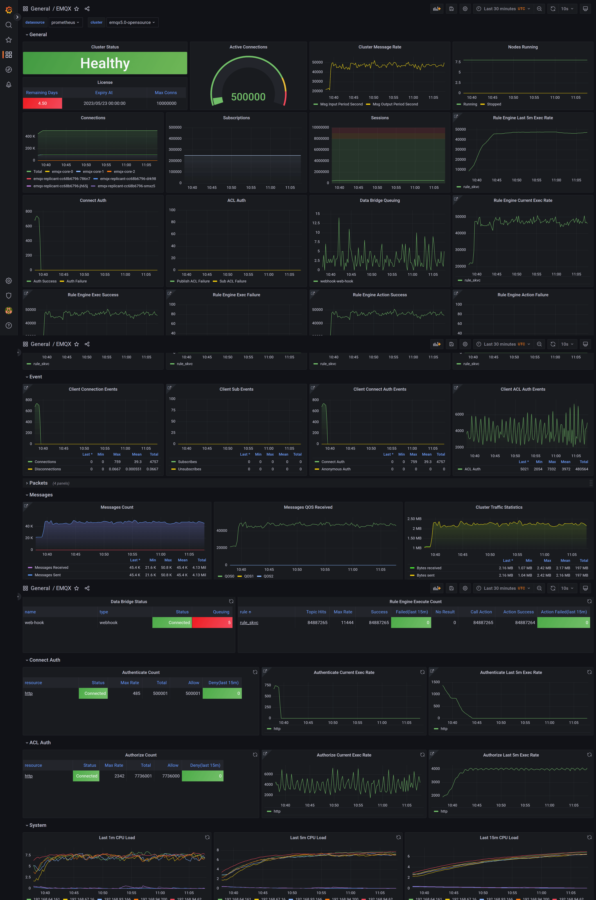

# EMQX Exporter 
The `emqx-exporter` is designed to expose partial metrics that don't include in the EMQX Prometheus API. It adapted to EMQX 4.4 and EMQX 5, both open-source and enterprise.



## Installation and Usage
The `emqx-exporter` listens on HTTP port 8085 by default. See the `--help` output for more options.

### Preparation
It requires access to the EMQX dashboard API with basic auth, so you need to sign in to the dashboard to create an API secret,
then pass the API key and secret to the startup argument as username and password.

Note that it is different to create a secret between EMQX 5 and EMQX 4.4.  
* **EMQX 5** create a new [API KEY](https://www.emqx.io/docs/en/v5.0/dashboard/system.html#api-keys) in the dashboard.
* **EMQX 4.4** create a new `User` instead of `Application`

### Docker

```bash
docker run -d \
  -p 8085:8085 \
  emqx-exporter:latest \
  --emqx.nodes="${your_cluster_addr}:18083"  \
  --emqx.auth-username=${apiKey} \
  --emqx.auth-password=${secretKey}
```

The arg `emqx.nodes` is a host list, the exporter will choose one to establish connection.  

EMQX Dashboard HTTP service listens on port `18083` by default, you may need to modify it according to the actual configuration.

For excluding metrics about the exporter itself, add a flag `--web.disable-exporter-metrics`.

Refer to the [example](examples/docker) to deploy a complete demo by docker.

### Docker-Compose

Refer to the [example](examples/docker-compose) to deploy a complete demo by docker-compose.

### Kubernetes
Refer to the [example](examples/k8s/README.md) to learn how to deploy `emqx-exporter` on the k8s.

## Prometheus Config
For EMQX 5 and above, make sure the EMQX cluster has exposed metrics by Prometheus, and check it in the dashboard(http://${your_cluster_addr}:18083/#/monitoring/integration).

__Note that disable the Prometheus push mode(PushGateway)__

Scrape Config:

```yaml
scrape_configs:
- job_name: 'emqx'
  metrics_path: /api/v5/prometheus/stats
  scrape_interval: 5s
  honor_labels: true
  static_configs:
    # EMQX IP address and port
    - targets: [${your_cluster_addr}:18083]
      labels:
        # label the cluster name of where the metrics data from
        cluster: ${your_cluster_name}
        # fix value, don't modify
        from: emqx
- job_name: 'exporter'
  metrics_path: /metrics
  scrape_interval: 5s
  static_configs:
    - targets: [${your_exporter_addr}:8085]
      labels:
        # label the cluster name of where the metrics data from
        cluster: ${your_cluster_name}
        # fix value, don't modify
        from: exporter
```

For EMQX 4.4, make sure the `emqx_prometheus` plugin has been started, and check it in the dashboard(http://your_cluster_addr:18083/#/plugins).

Refer to the [example](examples/docker/prometheus-emqx4.yaml) to learn how to add scrape configs for EMQX 4.4. 

## Grafana Dashboard
Import all [templates](./config/grafana-template) to your Grafana, then browse the dashboard `EMQX` and enjoy yourself!

Check out the [Instruction](config/grafana-template/README.md) to learn how to use the Grafana dashboard.

The templates of dashboard ares JSON files, about how to upload a dashboard JSON file, you can check out [here](https://grafana.com/docs/grafana/latest/dashboards/manage-dashboards/#import-a-dashboard). 

## Development

Prerequisites:

* [Go compiler](https://golang.org/dl/)

Building:

    git clone https://github.com/emqx/emqx-exporter.git
    cd emqx-exporter
    make build
    # cd to output folder `./build/$OS_$ARCH/`
    ./emqx-exporter <flags>

To see all available configuration flags:

    ./emqx-exporter -h

## TLS endpoint

** EXPERIMENTAL **

The exporter supports TLS via a new web configuration file.

```console
./emqx-exporter --web.config.file=web-config.yml
```

See the [exporter-toolkit https package](https://github.com/prometheus/exporter-toolkit/blob/v0.1.0/https/README.md) for more details.
