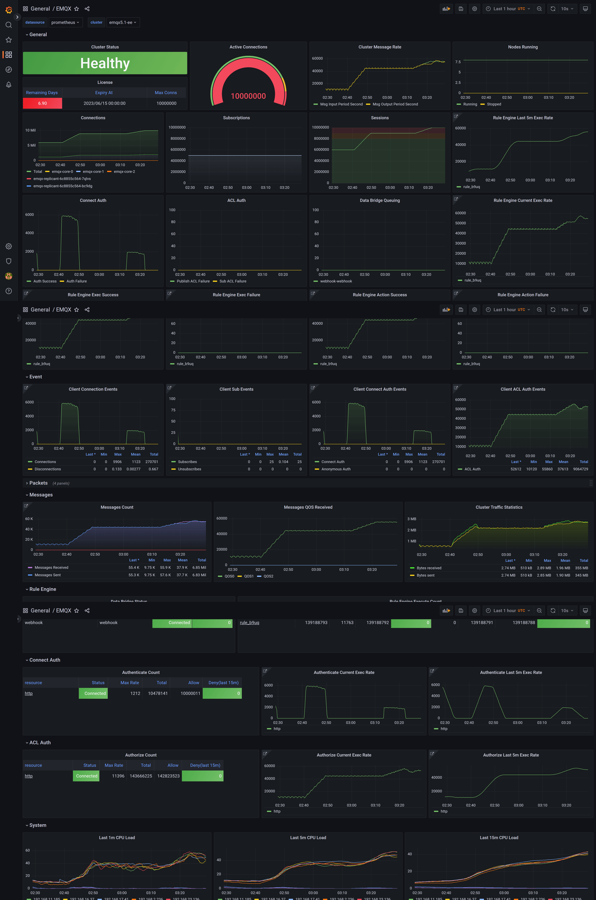

# EMQX Exporter
Prometheus exporter for EMQX cluster metrics exposed.



## Installation and Usage
The `emqx-exporter` listens on HTTP port 8085 by default. See the `--help` output for more options.

### API Secret
The `emqx-exporter` is designed to expose partial metrics that doesn't include in the EMQX prometheus API.
It requires access to the EMQX dashboard API with basic auth, so you need to sign in dashboard to create an API secret,
then pass the API key and secret to startup argument as username and password.

Note that it is different to create secret between EMQX 5.x and EMQX 4.x.  
* **EMQX 5** create a new [API KEY](https://www.emqx.io/docs/en/v5.0/dashboard/system.html#api-keys) in dashboard.
* **EMQX 4** create a new `User` instead of `Application`

### Docker

```bash
docker run -d \
  -p 8085:8085 \
  emqx-exporter:latest \
  --emqx.nodes="${your_cluster_addr}:18083"  \
  --emqx.auth-username=${apiKey} \
  --emqx.auth-password=${secretKey}
```

The arg `emqx.nodes` is a host list, the exporter will choose one to establish connection.  

EMQX Dashboard HTTP service listens on port `18083` by default, you may need to modify it according to the actual configuration.

For excluding metrics about exporter itself, add a flag `--web.disable-exporter-metrics`.

### Docker-Compose

```yaml
version: '3.8'

services:
  emqx-exporter:
    image: emqx-exporter:latest
    container_name: emqx-exporter
    command:
      - '--emqx.nodes=${your_cluster_addr}:18083'
      - '--emqx.auth-username=${apiKey}'
      - '--emqx.auth-password=${secretKey}'
    restart: unless-stopped
```

### Kubernetes

```yaml
apiVersion: v1
kind: Service
metadata:
  labels:
    app: emqx-exporter
  name: emqx-exporter-service
spec:
  ports:
  - name: metrics
    port: 8085
    targetPort: metrics
  selector:
    app: emqx-exporter
---
apiVersion: apps/v1
kind: Deployment
metadata:
  name: emqx-exporter
  labels:
    app: emqx-exporter
spec:
  selector:
    matchLabels:
      app: emqx-exporter
  replicas: 1
  template:
    metadata:
      labels:
        app: emqx-exporter
    spec:
      securityContext:
        runAsUser: 1000
      containers:
      - name: exporter
        image: emqx-exporter:latest
        imagePullPolicy: IfNotPresent
        args:
        - --emqx.nodes=${svc-name}:18083
        - --emqx.auth-username=${apiKey}
        - --emqx.auth-password=${secretKey}
        securityContext:
          allowPrivilegeEscalation: false
          runAsNonRoot: true
        ports:
        - containerPort: 8085
          name: metrics
          protocol: HTTP
        resources:
          limits:
            cpu: 100m
            memory: 100Mi
          requests:
            cpu: 100m
            memory: 20Mi
```

## Prometheus Config
For EMQX 5 and above, make sure the EMQX cluster has exposed metrics by prometheus, check it in dashboard(http://your_cluster_addr:18083/#/monitoring/integration).

__Note that disable the prometheus push mode(PushGateway)__  

Scrape Config:

```yaml
scrape_configs:
- job_name: 'emqx'
  metrics_path: /api/v5/prometheus/stats
  scrape_interval: 5s
  honor_labels: true
  static_configs:
    # EMQX IP address and port
    - targets: [${your_cluster_addr}:18083]
      labels:
        # label the cluster name of where the metrics data from
        cluster: ${your_cluster_name}
        # fix value, don't modify
        from: emqx
- job_name: 'exporter'
  metrics_path: /metrics
  scrape_interval: 5s
  static_configs:
    - targets: [${your_exporter_addr}:8085]
      labels:
        # label the cluster name of where the metrics data from
        cluster: ${your_cluster_name}
        # fix value, don't modify
        from: exporter
```

For EMQX 4, make sure the `emqx_prometheus` plugin has been started, check it in dashboard(http://your_cluster_addr:18083/#/plugins).

Scrape Config:

```yaml
scrape_configs:
- job_name: 'emqx'
  metrics_path: /api/v4/emqx_prometheus
  scrape_interval: 5s
  honor_labels: true
  static_configs:
    # EMQX IP address and port
    - targets: [${your_cluster_addr}:18083]
      labels:
        # label the cluster name of where the metrics data from
        cluster: ${your_cluster_name}
        # fix value
        from: emqx
  params:
    type: [prometheus]
  basic_auth:
    # EMQX 4 requires to use basic auth to access emqx_prometheus api 
    username: ${apiKey}
    password: ${secretKey}
- job_name: 'exporter'
  metrics_path: /metrics
  scrape_interval: 5s
  static_configs:
    - targets: [${your_exporter_addr}:8085]
      labels:
        # label the cluster name of where the metrics data from
        cluster: ${your_cluster_name}
        # fix value
        from: exporter
```

If you have deployed prometheus by [prometheus operator](https://prometheus-operator.dev/) or [kube-prometheus](https://github.com/prometheus-operator/kube-prometheus), then you need to create **PodMonitor** for
EMQX node and **ServiceMonitor** for exporter to add scrape jobs to prometheus config.

* EMQX 5:
```yaml
apiVersion: monitoring.coreos.com/v1
kind: PodMonitor
metadata:
  name: emqx-metrics
  labels:
    app: emqx-metrics
spec:
  selector:
    matchLabels:
      # the label of emqx pod
      apps.emqx.io/instance: emqx
      apps.emqx.io/managed-by: emqx-operator
  podMetricsEndpoints:
    # dashboard port
    - targetPort: 18083
      honorLabels: true
      interval: 5s
      path: /api/v5/prometheus/stats
      relabelings:
        - action: replace
          replacement: ${your_cluster_name}
          targetLabel: cluster
        - action: replace
          replacement: emqx
          targetLabel: from
        - action: replace
          sourceLabels: ['pod']
          targetLabel: "instance"
  namespaceSelector:
    matchNames:
      # modify the namespace if your EMQX cluster deployed in other namespace
      - default
  
---
apiVersion: monitoring.coreos.com/v1
kind: ServiceMonitor
metadata:
  name: emqx-exporter
  labels:
    app: emqx-exporter
spec:
  selector:
    matchLabels:
      # the label in emqx exporter svc
      app: emqx-exporter
  endpoints:
    # the port name of exporter svc
    - port: 8085
      honorLabels: true
      interval: 5s
      path: /metrics
      relabelings:
      - action: replace
        replacement: ${your_cluster_name}
        targetLabel: cluster
      - action: replace
        replacement: exporter
        targetLabel: from
      - action: labeldrop
        regex: 'pod'
  namespaceSelector:
    matchNames:
      # modify the namespace if your exporter deployed in other namespace
      - default
```

* EMQX 4:
```yaml
apiVersion: monitoring.coreos.com/v1
kind: PodMonitor
metadata:
  name: emqx-metrics
  labels:
    app: emqx-metrics
spec:
  selector:
    matchLabels:
      # the label of emqx pod
      apps.emqx.io/instance: emqx
      apps.emqx.io/managed-by: emqx-operator
  podMetricsEndpoints:
    # dashboard port
    - targetPort: 18083
      honorLabels: true
      interval: 5s
      path: /api/v4/emqx_prometheus
      params:
        type: prometheus
      basicAuth:
        username: ${apiKey}
        password: ${secretKey}
      relabelings:
        - action: replace
          replacement: ${your_cluster_name}
          targetLabel: cluster
        - action: replace
          replacement: emqx
          targetLabel: from
        - action: replace
          sourceLabels: ['pod']
          targetLabel: "instance"
  namespaceSelector:
    # modify the namespace if your EMQX cluster deployed in other namespace
    matchNames:
      - default
  
---
apiVersion: monitoring.coreos.com/v1
kind: ServiceMonitor
metadata:
  name: emqx-exporter
  labels:
    app: emqx-exporter
spec:
  selector:
    matchLabels:
      # the label in emqx exporter svc
      app: emqx-exporter
  endpoints:
    # the port name of exporter svc
    - port: 8085
      honorLabels: true
      interval: 5s
      path: /metrics
      relabelings:
      - action: replace
        replacement: ${your_cluster_name}
        targetLabel: cluster
      - action: replace
        replacement: exporter
        targetLabel: from
     - action: labeldrop
        regex: 'pod'
  namespaceSelector:
    # modify the namespace if your exporter deployed in other namespace
    matchNames:
      - default
```

## Grafana Dashboard
Import all [templates](./config/grafana-template) to your grafana, then browse the dashboard `EMQX` and enjoy yourself!

Refer the [Instruction](docs/en/grafana/instruction.md) to learn how to use grafana dashboard.

## Examples
You can get some examples [here](./examples).

## Development building and running

Prerequisites:

* [Go compiler](https://golang.org/dl/)
* RHEL/CentOS: `glibc-static` package.

Building:

    git clone https://github.com/emqx/emqx-exporter.git
    cd emqx-exporter
    make build
    # cd to output folder `./build/$OS_$ARCH/`
    ./emqx-exporter <flags>

To see all available configuration flags:

    ./emqx-exporter -h

## TLS endpoint

** EXPERIMENTAL **

The exporter supports TLS via a new web configuration file.

```console
./emqx-exporter --web.config.file=web-config.yml
```

See the [exporter-toolkit https package](https://github.com/prometheus/exporter-toolkit/blob/v0.1.0/https/README.md) for more details.
